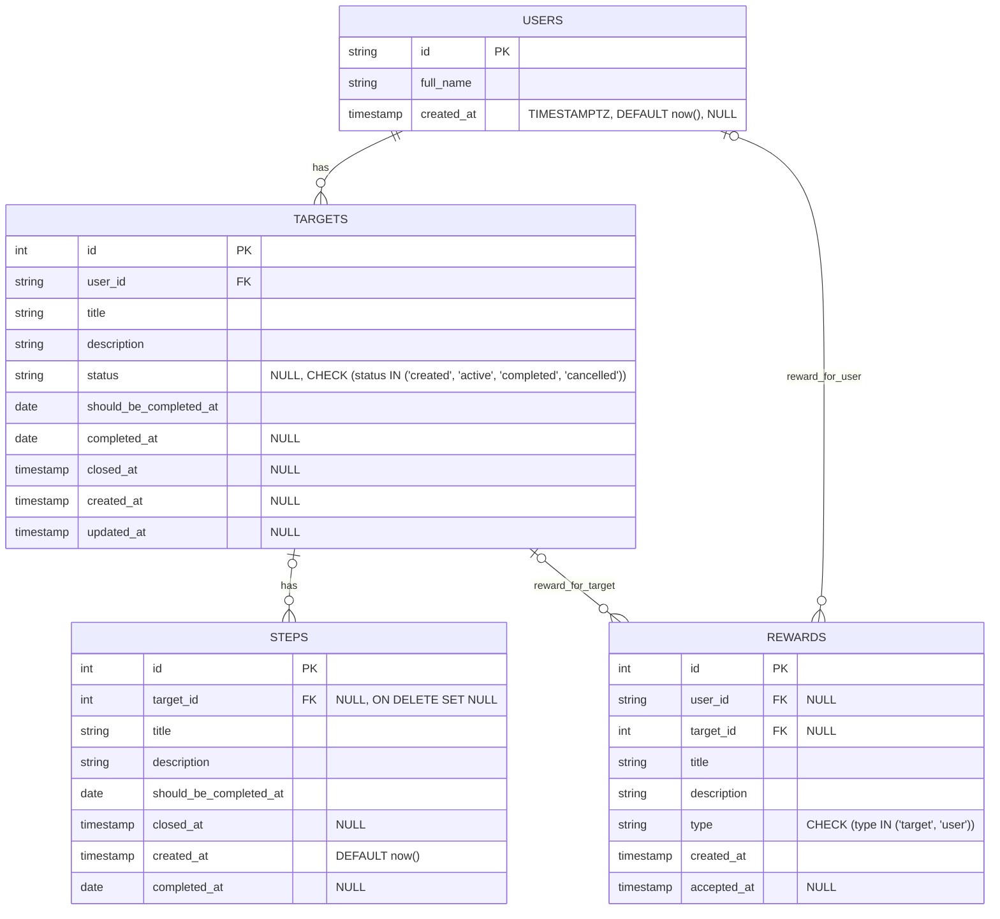

# goals-service

Сервис управления целями.

## dev-разработка

<strong>OpenAPI</strong>  

[Service](http://localhost:3000)  
[Swagger Health service](http://localhost:3000/health)  
[Swagger Goals service](http://localhost:3000/api)  
[JSON-api](http://localhost:3000/api-json)

### Скрипты

| Скрипт | Описание |
| --- | --- |
| `build` | Собирает проект в папку `dist`. |
| `format` | Форматирует TypeScript-файлы в `src` и `test` через Prettier. |
| `start` | Запускает приложение в обычном режиме через Nest. |
| `start:dev` | Запускает приложение в режиме разработки с автоперезапуском. |
| `start:debug` | Запускает приложение в debug-режиме с автоперезапуском. |
| `start:prod` | Запускает собранную production-версию из `dist/main`. |
| `lint` | Проверяет и автоматически исправляет проблемы линтинга ESLint. |
| `test` | Запускает unit-тесты Jest. |
| `test:watch` | Запускает тесты Jest в watch-режиме. |
| `test:cov` | Запускает тесты и формирует отчет покрытия. |
| `test:debug` | Запускает Jest в режиме отладки (`--runInBand`). |
| `test:e2e` | Запускает e2e-тесты с конфигом `test/jest-e2e.json`. |
| `migrate:create` | Создает новый SQL-файл миграции через `node-pg-migrate`. |
| `migrate:init` | Применяет миграции вверх (`up`) к базе данных. |
| `migrate:test:down` | Откатывает последнюю миграцию (`down`). |

### Отладка

**Через сокет в браузере**

1. Запустить веб-сокет для отладки: `start:debug`  
2. Перейти в chrome://inspect/#devices  
3. Нажать Inspect около директории с NestJS  

**Через подключение к процессу Node JS в VS Code**

1. Запустить разработку в режиме отладки V8: `start:debug`  
2. Запустить дебаггер через вкладку дебаггинга VS Code  
3. В консоли с запущенным Node JS процессом должна появится надпись "Debugger attached"

## Техническое задание (ТЗ) для проекта "Социальная система целей и наград"

## 1. Общее описание

Создать веб-приложение, в котором пользователи могут:
- создавать цели
- прикреплять промежуточные шаги к целям
- просматривать цели других пользователей
- прикреплять награды к завершенным целям
- прикреплять награды к пользователям, у которых достаточно звёзд

Другие пользователи также могут идеть статистику по баллам и штрафам.

## 2. Основные функции

**2.1 Регистрация и вход**

Пользователь должен иметь возможность зарегистрироваться и войти в систему.  
Аутентификация реализуется через JWT либо через сторонние OAuth-провайдеры.  

**2.2 Управление целями**

Пользователь может создавать **цель**  
Пользователь может создавать промежуточныe шаги у **цели**  

Пользователь может редактировать или отменить цель.  
Отменённая цель считается закрытой с вычетом звёзд.  

**2.3 Обработка целей**

За выполнение цели пользователь получает звёзды.  
За отмену цели — штраф: списывает звёзды у пользователя.  

**2.4 Просмотр целей**

Пользователь может просматривать список целей других пользователей.  

В списке отображаются:

- Статистика по количеству достигнутых целей и счет звёзд
- Возможность создать **награду** для завершенной цели, если не превышен лимит по просроченным шагам
- Возможность создать большую награду для другого пользователя, если у него есть нужное кол-во баллов

**2.5 Создание награды**

Пользователь может создать награду:

- Для закрытой цели другого пользователя, если она будет закрыта без 20% (далее будет детализировано) штрафов
- За определённое количество полученных звёзд за закрытые цели

**2.6 Статистика и награды**

За выполнение каждой цели пользователь получает звёзды (например, +10 звёзд).  

В профиле отображается:
- Общее число достигнутых целей
- Общее число полученных звёзд

## 3. Модели данных (актуально по SQL-миграциям)

**3.0 Концептуальная модель**

**Сущности**: `users`, `targets`, `steps`, `rewards`.

**ER-диаграмма**:

```mermaid
erDiagram
    USERS {
      string id PK
      string full_name
      timestamp created_at "TIMESTAMPTZ, DEFAULT now(), NULL"
    }
    TARGETS {
      int id PK
      string user_id FK
      string title
      string description
      string status "NULL, CHECK (status IN ('created', 'active', 'completed', 'cancelled'))"
      date should_be_completed_at
      date completed_at "NULL"
      timestamp closed_at "NULL"
      timestamp created_at "NULL"
      timestamp updated_at "NULL"
    }
    STEPS {
      int id PK
      int target_id FK "NULL, ON DELETE SET NULL"
      string title
      string description
      date should_be_completed_at
      timestamp closed_at "NULL"
      timestamp created_at "DEFAULT now()"
      date completed_at "NULL"
    }
    REWARDS {
      int id PK
      string user_id FK "NULL"
      int target_id FK "NULL"
      string title
      string description
      string type "CHECK (type IN ('target', 'user'))"
      timestamp created_at
      timestamp accepted_at "NULL"
    }

    USERS ||--o{ TARGETS : has
    TARGETS |o--o{ STEPS : has
    TARGETS |o--o{ REWARDS : reward_for_target
    USERS |o--o{ REWARDS : reward_for_user
```

> Примечание: в текущих миграциях таблица наград называется `surprises`.

**3.4 Статистика**
Собирается динамически из данных целей, звёзд, наград.  

### 4. Логика бизнес-процессов

**Создание цели**: пользователь заходит в систему, создает цель, время, когда нужно ее завершить добавляет шаги (или без шагов) и нажимает "Старт".  
**Назначение награды к цели**: другой пользователь заходит в систему, добавляет награду к завершенной цели,если она была закрыта без превышения лимитов по штрафам.  
**Назначение награды за баллы**: другой пользователь заходит в систему, переходит в профиль пользователя  
и создает награду за звёзды, у другого пользователя списываются звёзды, если он принимает награду.  
**Отмена цели**: пользователь нажимает кнопку "Отменить", фиксируется дата отмены, списываются звёзды.  
**Выполнение шага**: когда наступает дата выполнения шага, то пользователь должен записать итог шага и пометить его как выполненный.  
**Получение наград**: после достижения цели пользователю начисляются звёзды.  

### 5. Технические требования

Backend: NestJS с использованием PostgreSQL (`pg` + SQL-миграции через `node-pg-migrate`).  
Аутентификация: JWT либо сторонние OAuth-провайдеры.  
API: RESTful.  
Безопасность: защита эндпоинтов, проверка прав доступа.  
Миграции/обновление схем: при необходимости.  

### 6. Дополнительные требования

Возможность просмотра списка целей в ЛК.  
Возможность баллов в ЛК.  
Фильтрация целей по статусу, дате, автору.  

### TODO

* [x] ~~Исследовать возможность добавления предтестов на проверку наличия всех моков модулей,
      чтобы максимально изолировать тесты~~ – **Добавлен автомокинг**
* [ ] Добавить базовый логгинг
* [ ] Добавить базовый сбор метрик в Prometheus
