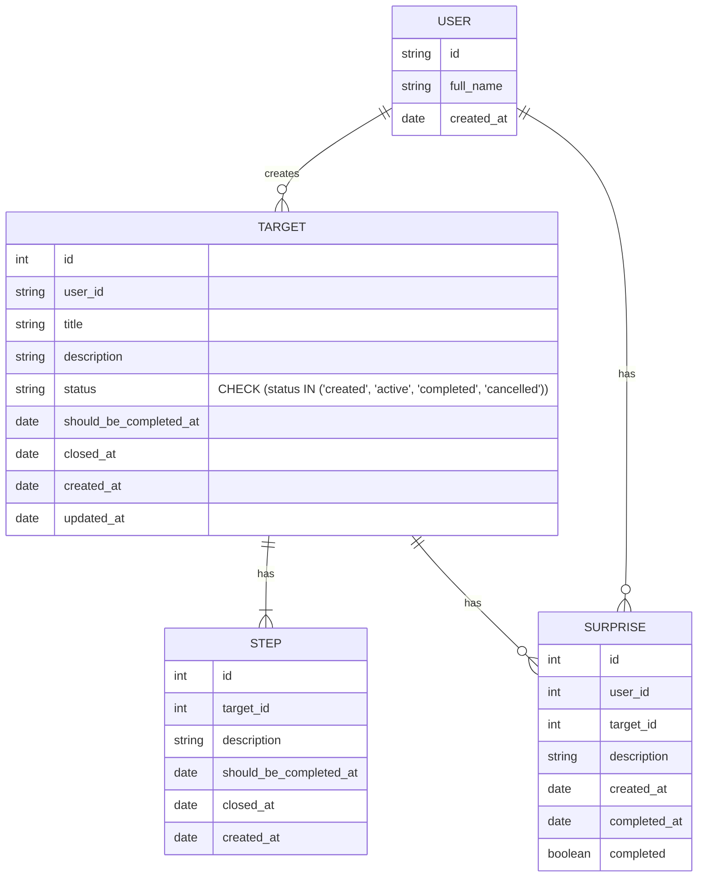

# goals-mongodb

Сервис управления целями.

## dev-ресурсы

<strong>OpenAPI</strong> <br />

[Swagger Health service](http://localhost:3000/health) <br />
[Swagger Goals service](http://localhost:3000/api) <br />
[JSON-api](http://localhost:3000/api-json)

## Техническое задание (ТЗ) для проекта "Социальная система целей и сюрпризов"

## 1. Общее описание

Создать веб-приложение, в котором пользователи могут создавать личные цели, назначать промежуточные шаги, а также просматривать цели других пользователей. <br />

Другие пользователи могут создавать сюрпризы за закрытие цели или за достижение целей, а также видеть статистику по баллам и штрафам.

## 2. Основные функции

**2.1 Регистрация и вход**

Пользователь должен иметь возможность зарегистрироваться и войти в систему. <br />
Аутентификация реализуется через JWT либо через сторонние OAuth-провайдеры. <br />

**2.2 Управление целями**

Пользователь может создавать **цель**: название, статус, описание, дата создания, дата выполнения. <br />
Пользователь может создавать промежуточныe шаги у **цели**: описание, дата выполнения. <br />

Пользователь может редактировать или отменить цель. <br />
Отменённая цель считается закрытой с вычетом баллов. <br />

**2.3 Обработка целей**

За выполнение цели пользователь получает звёзды. <br />
За отмену цели — штраф, который вычетает баллы из счета пользователя. <br />

**2.4 Просмотр целей**

Пользователь может просматривать список целей других пользователей. <br />

В списке отображаются:

– Статистика по количеству достигнутых целей и счет баллов;
– Возможность создать **сюрприз** для завершенной цели, если не превышен лимит по просроченным шагам; <br />
– Возможность создать большой сюрприз для другого пользователя, если у него есть нужное кол-во баллов. <br />

**2.5 Создание сюрприза**

Пользователь может создать сюрприз:

– Для закрытой цели другого пользователя, если она будет закрыта без 20% (далее будет детализировано) штрафов; <br />
– За определённое количество полученных баллов за закрытые цели. <br />

**2.6 Статистика и награды**

За выполнение каждой цели пользователь получает баллы (например, +10 баллов). <br />

В профиле отображается: <br />
– Общее число достигнутых целей. <br />
– Общее число полученных баллов. <br />

## 3. Модели данных (примерная структура)

**3.0 Концептуальная модель**

**Сущности**: Пользователь, Цель, Шаг цели, Сюрприз(или Приз).

**ER-диаграмма**:



**3.1 User (пользователь)**

```json
{
  "id": String,
  "full_name": String,
  "created_at": Date
}
```

**3.2 Target (цель)**

```json
{
  "id": Int, // SERIAL
  "user_id": String,
  "title": String,
  "description": String,
  "status": String | null, // "created", "active", "completed", "cancelled"
  "should_be_completed_at": Date,
  "closed_at": Date | null,
  "created_at": Date | null,
  "updated_at": Date | null
}
```

**Step (шаг)**

```json
  {
    "id": Int,
    "target_id": Int,
    "description": String,
    "created_at": Date,
    "completed_at": Date,
    "completed": Boolean
  }
```

**3.3 Surprise (сюрприз)**

```json
{
  "id": Int,
  "user_id": Int,
  "target_id": Int, // id цели
  "type": String, // "target" или "stars"
  "message": String,
  "created_at": Date,
  "is_accepted": Boolean,
  "accepted_at": Date
}
```

**3.4 Статистика**
Собирается динамически из данных целей, звезд, сюрпризов. <br />

### 4. Логика бизнес-процессов

**Создание цели**: пользователь заходит в систему, создает цель, добавляет шаги и нажимает "Старт". <br />
**Назначение приза к цели**: другой пользователь заходит в систему, добавляет приз к завершенной цели, если она была закрыта без превышения лимитов по штрафам. <br />
**Назначение приза за баллы**: другой пользователь заходит в систему, переходит в профиль пользователя <br />
и создает приз за баллы, у другого пользователя списываются баллы. <br />
**Отмена цели**: пользователь нажимает кнопку "Отменить", фиксируется дата отмены, баллы не начисляются. <br />
**Выполнение шага**: когда наступает дата выполнения шага, то пользователь должен записать итог шага и пометить его как выполненный. <br />
**Получение наград**: после достижения цели пользователю начисляются баллы, обновляются параметры пользователя. <br />

### 5. Технические требования

Backend: NestJS с использованием MongoDB. <br />
Аутентификация: JWT либо сторонние OAuth-провайдеры. <br />
API: RESTful или GraphQL (выберите по желанию). <br />
Безопасность: защита эндпоинтов, проверка прав доступа. <br />
Миграции/обновление схем: при необходимости. <br />

### 6. Дополнительные требования

Возможность просмотра списка целей в ЛК. <br />
Возможность баллов в ЛК. <br />
Фильтрация целей по статусу, дате, автору. <br />
