# ADR: E2E-тестирование с Testcontainers

**Статус:** принято и реализовано.

## Контекст

Goals Service выполняет параметризованные SQL-запросы через repository-слой и
опирается на ограничения PostgreSQL, миграции и транзакции. Моки `DbService` не
проверяют совместимость запросов с реальной схемой, каскадные удаления,
уникальность и конкурентные сценарии.

Для проверки прикладных сценариев нужна изолированная PostgreSQL с той же
схемой, которая используется приложением.

## Решение

Прикладные e2e-наборы запускают PostgreSQL 17 через Testcontainers и работают с
реальным `DbService`.

Последовательность подготовки тестового набора:

```mermaid
flowchart LR
    A[Запустить postgres:17-alpine] --> B[Получить connection URI]
    B --> C[Установить DATABASE_URL]
    C --> D[Применить миграции]
    D --> E[Создать Nest-приложение с реальным DbService]
    E --> F[Подготовить данные через factories]
    F --> G[Выполнить HTTP-сценарий и проверить БД]
    G --> H[Очистить таблицы]
    H --> I[Остановить приложение и контейнер]
```

Текущая реализация:

- использует образ `postgres:17-alpine`;
- передаёт URI контейнера через `DATABASE_URL`;
- применяет все миграции командой `pnpm run migrate:init`;
- создаёт Nest-приложение через `createTestingApp` с настоящим `DbService`;
- подменяет аутентификацию тестовым guard, чтобы сценарии не зависели от
  внешнего auth-сервиса;
- создаёт данные через factories и очищает таблицы между тестами;
- освобождает соединение и останавливает контейнер после набора тестов.

## Последствия

Положительные:

- SQL и миграции проверяются на настоящей PostgreSQL;
- тесты покрывают ограничения БД, транзакции и конкурентные запросы;
- каждый набор получает изолированную базу и не зависит от локальных данных
  разработчика.

Ограничения:

- для запуска нужен работающий Docker daemon;
- e2e-тесты выполняются медленнее unit-тестов из-за запуска контейнера и
  миграций;
- окружение контейнера необходимо корректно останавливать даже после ошибки
  теста.

## Границы решения

Testcontainers используется для e2e-сценариев, которым необходима настоящая
база данных. Unit-тесты и простая проверка health endpoint могут выполняться без
контейнера. Генерация Swagger-моков в Jest global setup также является
отдельным процессом и не требует PostgreSQL.
