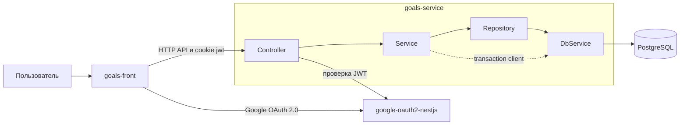

# Обзор архитектуры

## Компоненты системы

Система состоит из трёх самостоятельных репозиториев:

- **goals-front** — пользовательский интерфейс: запускает сценарии
  аутентификации и обращается к HTTP API целей;
- **goals-service** — backend этого репозитория: хранит пользователей, цели,
  шаги и награды, применяет правила операций и предоставляет REST API;
- **google-oauth2-nestjs** — auth-сервис: интегрируется с Google OAuth 2.0,
  выдаёт JWT и подтверждает пользователя по токену для Goals Service.

PostgreSQL принадлежит Goals Service и не используется frontend напрямую.



## Взаимодействие компонентов

1. Пользователь работает с интерфейсом `goals-front`.
2. `google-oauth2-nestjs` выполняет сценарий Google OAuth 2.0 и предоставляет
   JWT клиенту.
3. Клиент отправляет запросы в `goals-service` с JWT в cookie.
4. Перед выполнением защищённой операции `goals-service` подтверждает токен и
   получает пользователя через auth-сервис.
5. После успешной проверки Goals Service выполняет операцию и читает либо
   изменяет данные в собственной PostgreSQL.

Недоступность auth-сервиса не позволяет выполнять защищённые операции, но не
даёт frontend или auth-сервису прямого доступа к базе Goals Service.

## Внутренняя архитектура Goals Service

Обработка прикладного запроса проходит по фиксированной цепочке:

```text
controller
→ service
→ repository
→ DbService
→ PostgreSQL
```

- **Controller** отвечает за HTTP-маршрут, DTO, path-параметры и получение
  контекста запроса.
- **Service** выполняет проверки сценария, рассчитывает результат и управляет
  транзакциями составных операций.
- **Repository** содержит параметризованные SQL-запросы и преобразует обращения
  к данным в операции PostgreSQL.
- **DbService** управляет пулом `pg`, выполняет запросы и выдаёт клиент
  соединения для транзакций.
- **PostgreSQL** хранит данные и обеспечивает внешние ключи, уникальность,
  проверки и каскадные удаления.

Controller не обращается к базе напрямую, а Repository не принимает решений о
допустимости бизнес-операции. Подробности маршрутов находятся в
[системной спецификации](../system/system-specification.md), структура таблиц —
в [модели данных](../system/data-model.md).

## Архитектурные решения

Принятые решения хранятся в подразделе ADR:

- [E2E-тестирование с Testcontainers](./adr/testing.md).
