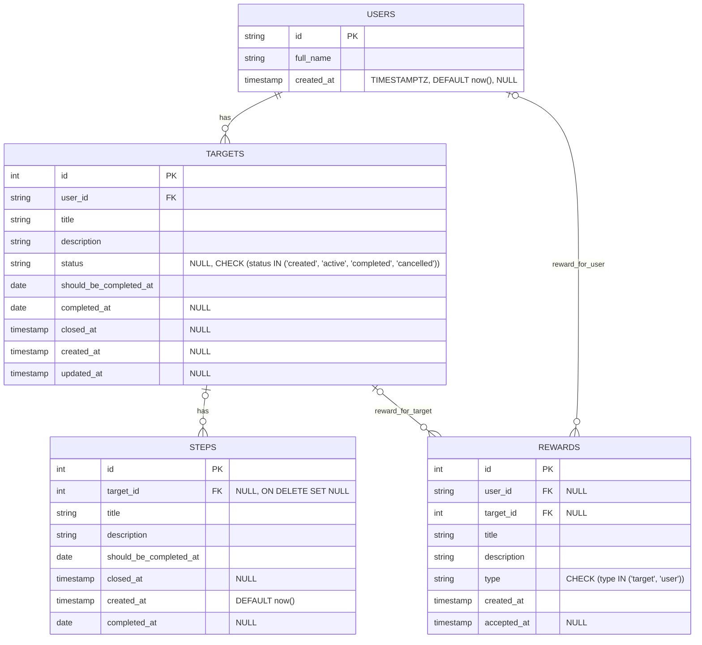

# 3. Модели данных (актуально по SQL-миграциям)

## 3.0 Концептуальная модель

**Сущности**: `users`, `targets`, `steps`, `rewards`.

**ER-диаграмма**:

## 3.1 Статистика

Собирается динамически из данных целей, звёзд, наград.
