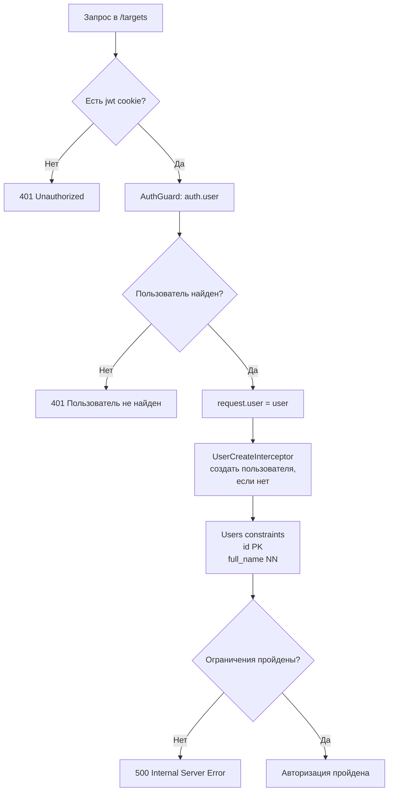
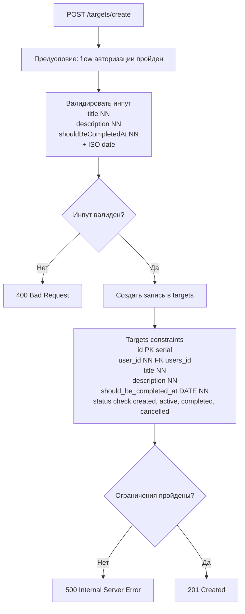
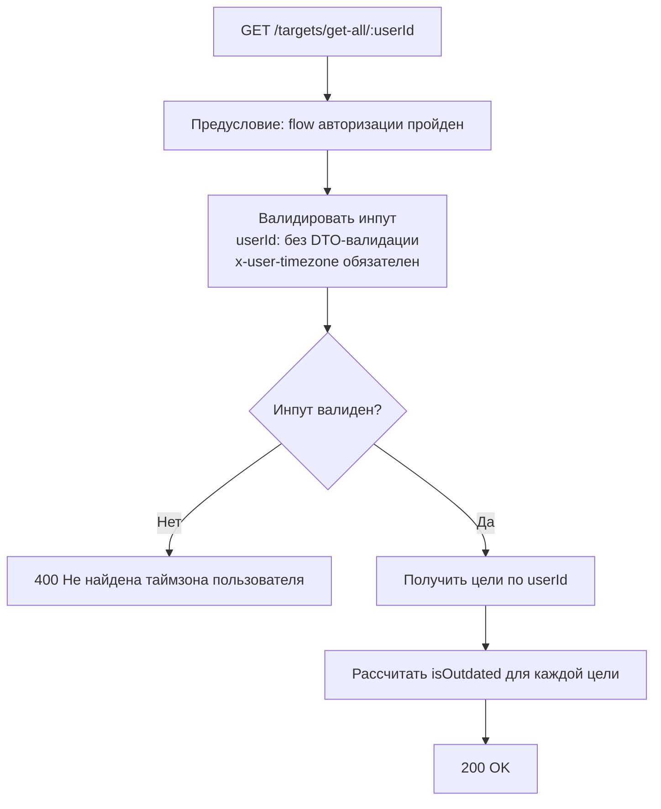

# 7. User Flow (targets)

## 7.1 Flow авторизации

```mermaid
---
config:
  flowchart:
    wrappingWidth: 320
---
flowchart TD
    A["Запрос в /targets"] --> B{"Есть jwt cookie?"}
    B -- Нет --> E[401 Unauthorized]
    B -- Да --> C["AuthGuard: auth.user"]
    C --> D{"Пользователь найден?"}
    D -- Нет --> F[401 Пользователь не найден]
    D -- Да --> G["request.user = user"]
    G --> H["UserCreateInterceptor<br/>создать пользователя,<br/> если нет"]
    H --> I["Users constraints<br/>id PK<br/>full_name NN<br/>"]
    I --> J{"Ограничения пройдены?"}
    J -- Нет --> X[500 Internal Server Error]
    J -- Да --> K[Авторизация пройдена]
```

## 7.2 Flow создания цели (`POST /targets/create`)

```mermaid
---
config:
  flowchart:
    wrappingWidth: 320
---
flowchart TD
    A["POST /targets/create"] --> B["Предусловие: flow авторизации пройден"]
    B --> C["Валидировать инпут<br/>title NN<br/>description NN<br/>shouldBeCompletedAt NN<br/>+ ISO date"]
    C --> D{"Инпут валиден?"}
    D -- Нет --> E[400 Bad Request]
    D -- Да --> F["Создать запись в targets"]
    F --> G["Targets constraints<br/>id PK serial<br/>user_id NN FK users_id<br/>title NN<br/>description NN<br/>should_be_completed_at DATE NN<br/>status check created, active, completed, cancelled"]
    G --> H{"Ограничения пройдены?"}
    H -- Нет --> I[500 Internal Server Error]
    H -- Да --> J[201 Created]
```

## 7.3 Flow получения целей (`GET /targets/get-all/:userId`)

```mermaid
---
config:
  flowchart:
    wrappingWidth: 320
---
flowchart TD
    A["GET /targets/get-all/:userId"] --> B["Предусловие: flow авторизации пройден"]
    B --> C["Валидировать инпут<br/>userId: без DTO-валидации<br/>x-user-timezone обязателен"]
    C --> D{"Инпут валиден?"}
    D -- Нет --> E[400 Не найдена таймзона пользователя]
    D -- Да --> F["Получить цели по userId"]
    F --> G["Рассчитать isOutdated для каждой цели"]
    G --> H[200 OK]
```
