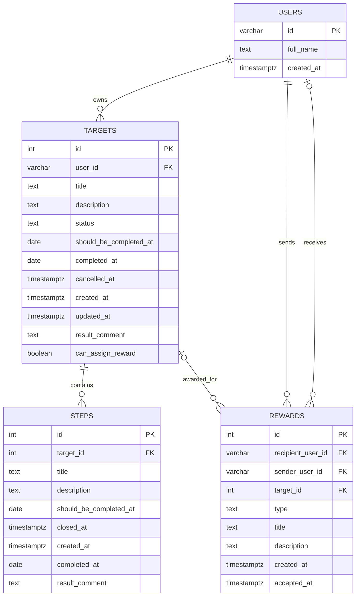

# Модель данных

## Назначение

Документ описывает актуальную структуру данных Goals Service: основные
сущности, связи и ограничения PostgreSQL.

## ER-диаграмма

Поля без отдельной отметки nullable на диаграмме показаны концептуально. Точная
обязательность описана ниже.

## Сущности

### `users`

Локальное представление пользователя, подтверждённого auth-сервисом.

- `id` — строковый идентификатор пользователя и первичный ключ;
- `full_name` — обязательное имя;
- `created_at` — время первого сохранения пользователя, по умолчанию текущее.

Один пользователь может владеть несколькими целями и отправлять несколько
наград.

### `targets`

Цель пользователя.

- `id` — числовой первичный ключ;
- `user_id` — обязательная ссылка на владельца;
- `title`, `description` и `should_be_completed_at` — обязательные данные цели;
- `status` — один из `created`, `active`, `completed`, `cancelled`;
- `completed_at`, `cancelled_at`, `result_comment` и `can_assign_reward` —
  результат завершения или отмены, допускают `NULL`;
- `created_at` — обязательное время создания;
- `updated_at` — необязательное время обновления.

В текущей схеме колонка `status` допускает `NULL`, хотя приложение всегда
создаёт цель со статусом `created`. Ограничение базы запрещает неизвестные
непустые статусы, а триггер запрещает движение назад по их порядку. Допустимые
переходы прикладного API дополнительно проверяет сервис.

### `steps`

Шаг, принадлежащий одной цели.

- `id` — числовой первичный ключ;
- `target_id` — обязательная ссылка на цель;
- `title`, `description`, `should_be_completed_at` и `created_at` — обязательные
  данные шага;
- `completed_at` и `result_comment` — результат завершения, допускают `NULL`;
- `closed_at` — унаследованное необязательное поле схемы, которое текущий flow
  завершения шага не заполняет.

Для одной цели дата `should_be_completed_at` должна быть уникальной.

### `rewards`

Награда, которую один пользователь назначает цели либо другому пользователю.

- `sender_user_id` — обязательная ссылка на отправителя;
- `target_id` — ссылка на цель для награды типа `target`;
- `recipient_user_id` — ссылка на получателя для награды типа `user`;
- `type` — `target` или `user`;
- `title`, `description` и `created_at` — обязательные данные награды;
- `accepted_at` — необязательное время принятия.

Для типа `target` должна быть заполнена только `target_id`, для типа `user` —
только `recipient_user_id`. API сейчас создаёт только награды типа `target`.

## Основные связи

| Связь                 | Кардинальность                               | Поведение при удалении                             |
| --------------------- | -------------------------------------------- | -------------------------------------------------- |
| `users` → `targets`   | один ко многим                               | цели удаляются вместе с пользователем              |
| `targets` → `steps`   | один ко многим                               | шаги удаляются вместе с целью                      |
| `targets` → `rewards` | цель к нескольким наградам                   | награды цели удаляются вместе с целью              |
| `users` → `rewards`   | пользователь отправляет или получает награды | связанные награды удаляются вместе с пользователем |

## Ключевые ограничения базы данных

- внешние ключи сохраняют целостность связей пользователей, целей, шагов и
  наград;
- уникальная пара `(target_id, should_be_completed_at)` не допускает два шага
  цели с одной датой;
- частичный уникальный индекс `(target_id, sender_user_id)` не допускает две
  награды типа `target` от одного отправителя на одну цель;
- аналогичный индекс `(recipient_user_id, sender_user_id)` подготовлен для
  наград типа `user`;
- `CHECK` для `rewards` согласует тип награды с заполненной ссылкой на цель или
  получателя;
- `CHECK` для статуса цели ограничивает набор непустых значений;
- триггер статуса запрещает обратное движение, но сам по себе не запрещает
  пропуск промежуточного статуса; точные переходы контролирует сервис;
- индекс даты шага ускоряет выборки и проверки по дедлайну.

Дедлайны и даты завершения целей и шагов имеют тип `DATE`. Времена создания,
отмены и принятия награды хранятся с часовым поясом.
