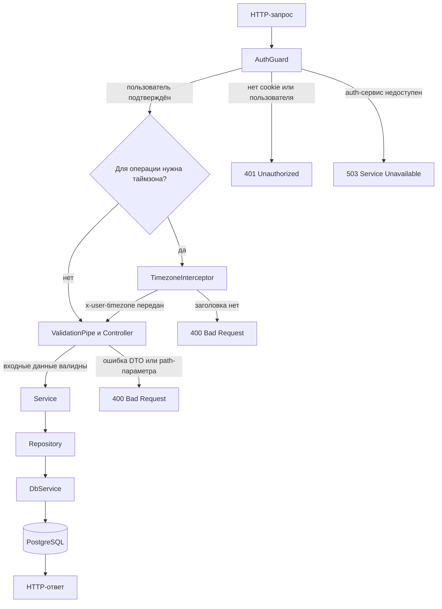
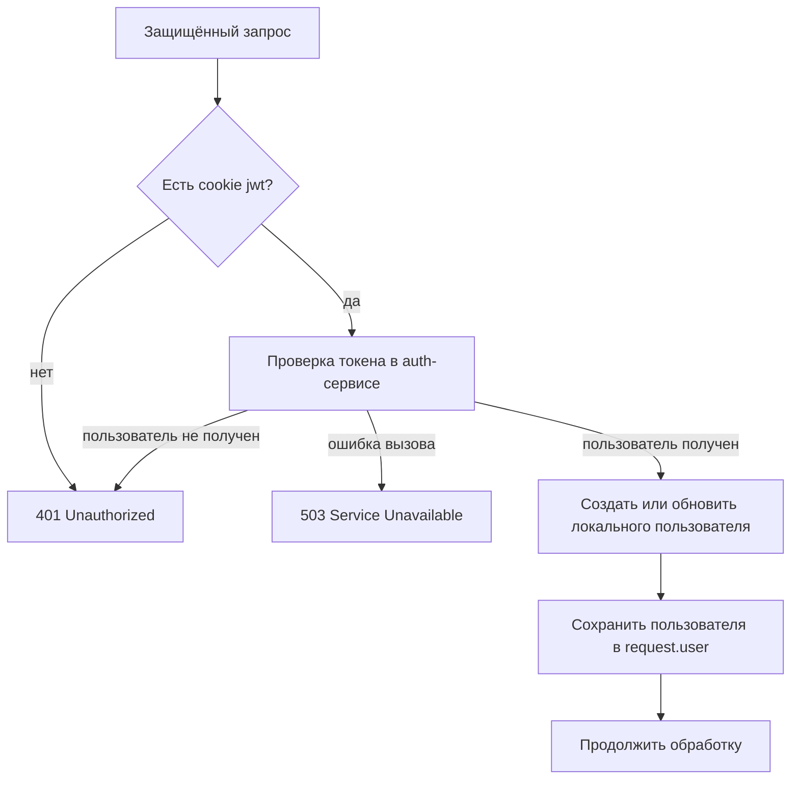
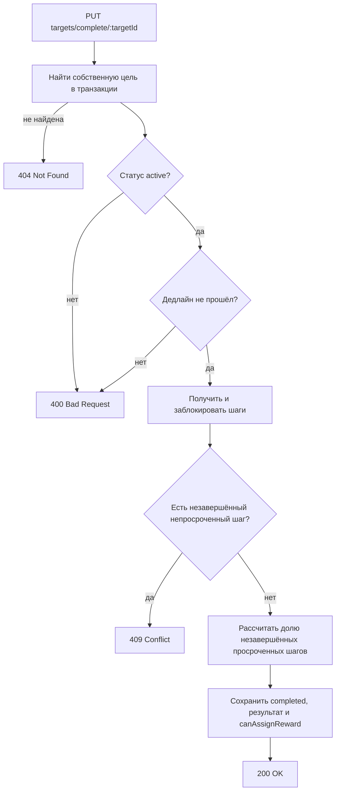
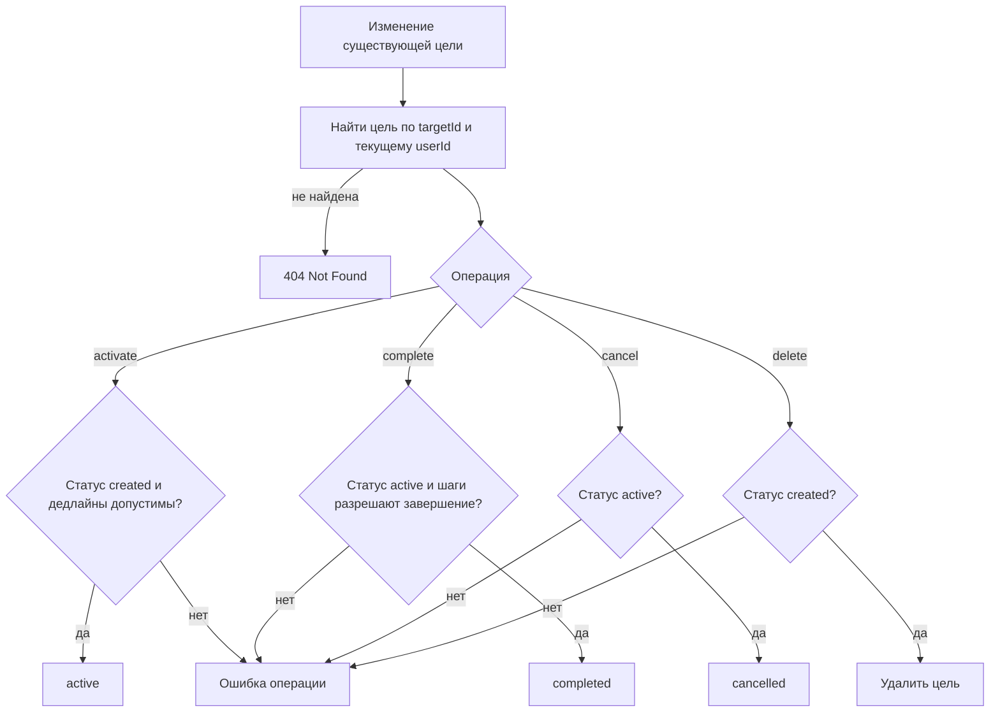
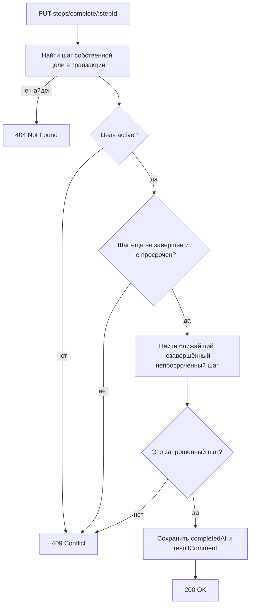
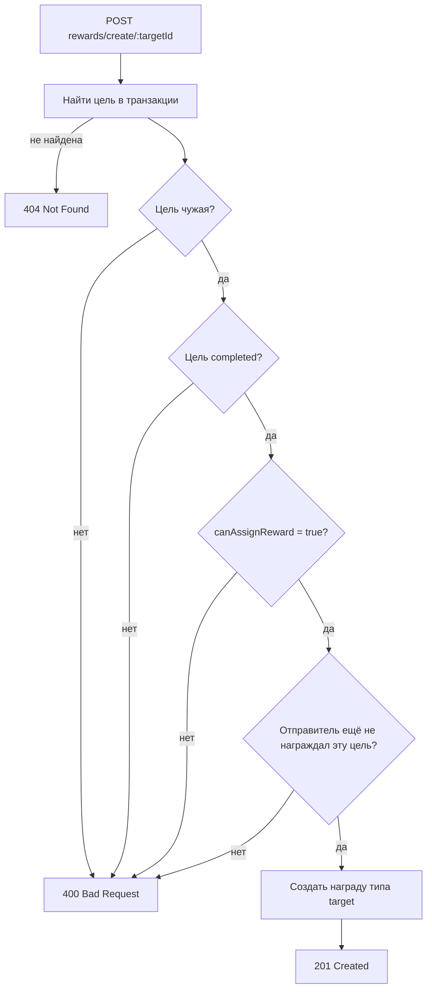

# Системная спецификация

## Назначение

Документ описывает текущий HTTP API Goals Service и то, как система реализует
бизнес-правила: последовательность обработки
запросов, проверки, ошибки и результаты операций.

Базовый префикс прикладного API — `/api/v1`. Актуальная интерактивная схема
доступна в Swagger по адресу `/api/v1/docs` запущенного сервиса.

## Общая обработка запроса

Все операции с пользователями, целями, шагами и наградами защищены. Типовая
последовательность выглядит так:

Для составных изменений сервис открывает транзакцию, блокирует необходимые
записи, выполняет проверки и фиксирует результат. При ошибке транзакция
откатывается.

Числовые идентификаторы цели и шага проверяются через `ParseIntPipe`.
Некорректное значение приводит к `400 Bad Request` до вызова сервиса.

## Авторизация

Клиент передаёт JWT в cookie `jwt`. `AuthGuard` отправляет токен auth-сервису с
сообщением `auth.user`. Полученный пользователь создаётся или обновляется в
локальной таблице `users`, после чего помещается в контекст запроса.

| Ситуация                              | Результат                                    |
| ------------------------------------- | -------------------------------------------- |
| Cookie `jwt` отсутствует              | `401 Unauthorized`                           |
| Auth-сервис не вернул пользователя    | `401 Unauthorized`                           |
| Вызов auth-сервиса завершился ошибкой | `503 Service Unavailable`                    |
| Пользователь подтверждён              | обработка endpoint продолжается от его имени |

## Даты и `x-user-timezone`

Дедлайны целей и шагов хранятся как календарные даты. Для сравнений с текущим
днём сервис использует заголовок `x-user-timezone`.

Заголовок обязателен для:

- всех endpoint'ов `/targets`, включая отмену и удаление;
- создания, просмотра и завершения шага.

Заголовок не требуется для удаления шага, создания награды и получения списка
пользователей. Сейчас проверяется только наличие непустого значения; валидность
названия часового пояса отдельно не проверяется.

Правила сравнения дат:

- создать цель или шаг можно только с дедлайном позже текущего дня;
- при активации и завершении дедлайн на текущий день допустим;
- объект считается просроченным, если дедлайн раньше текущего дня либо дата его
  завершения позже дедлайна;
- время внутри переданного ISO-значения не участвует в хранении дедлайна.

## Цели

### Создание цели

`POST /api/v1/targets/create`

Тело запроса:

| Поле                  | Тип             | Проверка                             |
| --------------------- | --------------- | ------------------------------------ |
| `title`               | значение        | обязательно и не пусто               |
| `description`         | значение        | обязательно и не пусто               |
| `shouldBeCompletedAt` | ISO date string | обязательно, дата позже текущего дня |

Сервис берёт владельца из `request.user`, создаёт цель в статусе `created` и
возвращает массив с созданной целью. В элемент входят `id`, `userId`, `title`,
`description`, `status` и `shouldBeCompletedAt`.

Ошибки валидации и дедлайн на текущий либо прошедший день возвращают `400`.

### Получение целей

`GET /api/v1/targets/get-all-own`

Endpoint не принимает path- или query-параметры. Идентификатор владельца
берётся из `request.user`, поэтому возвращаются только цели текущего
пользователя во всех статусах.

Каждый элемент массива содержит `id`, `userId`, `title`, `description`,
`status`, `shouldBeCompletedAt`, рассчитанный признак `isOutdated`, а также
массивы `steps` и `rewards`. В `steps` входят все связанные с целью шаги, в
`rewards` — все связанные с ней награды. Если связанных объектов нет,
соответствующее поле содержит пустой массив. Если у пользователя нет целей,
endpoint возвращает пустой массив. Порядок целей, шагов и наград не задан.

### Получение целей другого пользователя для назначения награды

`GET /api/v1/users/:userId/targets`

Endpoint предназначен для просмотра целей пользователя `userId` текущим
аутентифицированным пользователем. `userId` владельца цели берётся из path,
идентификатор текущего пользователя — из `request.user`; передавать его в path,
query или body не требуется. Заголовок `x-user-timezone` для расчёта заявленных
полей не нужен.

Ответ — массив целей, удовлетворяющих одновременно двум условиям:

- цель принадлежит пользователю `userId`;
- цель находится в статусе `active` или `completed`.

Если таких целей нет, endpoint возвращает `200 OK` и пустой массив. Каждый
элемент ответа содержит `id`, `title`, `description`, `status`,
`shouldBeCompletedAt`, `canAssignReward`, `steps` и `reward`.

Каждый элемент `steps` содержит `id`, `targetId`, `title`, `description`,
`shouldBeCompletedAt` и `completedAt`.

Поле `reward` содержит награду типа `target`, которую текущий
пользователь назначил этой цели, либо `null`, если такой награды нет.
Объект награды содержит `id`, `targetId`, `title`, `description`, `type`,
`createdAt` и `acceptedAt`. Поле `canAssignReward` возвращается из `target`
без расчёта в этом endpoint.

Последовательность чтения:

1. `AuthGuard` определяет текущего пользователя.
2. Выбираются цели владельца `userId` только в статусах `active` и `completed`.
3. Для каждой цели выбирается награда типа `target`, у которой
   отправитель — текущий пользователь; при её отсутствии выбирается `null`.
4. Возвращается массив; отсутствие строк не считается ошибкой.

### Активация цели

`PUT /api/v1/targets/activate/:targetId`

Проверки выполняются в транзакции:

1. Цель существует и принадлежит текущему пользователю.
2. Цель находится в статусе `created`.
3. Дедлайн цели не прошёл.
4. Ни один шаг цели не просрочен.

При успехе статус меняется на `active`, ответ имеет вид `{ "id": number }`.
Отсутствующая или чужая цель возвращает `404`; неверный статус, прошедший
дедлайн или просроченный шаг — `400`.

### Завершение цели

`PUT /api/v1/targets/complete/:targetId`

Тело запроса содержит обязательную непустую строку `resultComment`.

Награда разрешается, если рассчитанная доля строго меньше
`MAX_OUTDATED_STEPS_PERCENTAGE`. Если переменная отсутствует или не является
числом, используется порог `20`. Цель без шагов получает долю `0`.

Успешный ответ: `{ "completedAt": "YYYY-MM-DD" }`. Отсутствующая или чужая
цель возвращает `404`, неверный статус или прошедший дедлайн — `400`, наличие
незавершённого непросроченного шага — `409`.

### Отмена цели

`POST /api/v1/targets/cancel/:targetId`

В транзакции сервис ищет собственную цель и требует статус `active`. При успехе
сохраняются статус `cancelled` и время отмены, ответ имеет вид
`{ "id": number }`. Отсутствующая или чужая цель возвращает `404`, другой
статус — `400`.

### Удаление цели

`DELETE /api/v1/targets/delete/:targetId`

В транзакции сервис ищет собственную цель и требует статус `created`. При
успехе возвращается `{ "id": number }`. Связанные шаги и награды удаляются
каскадно. Отсутствующая или чужая цель возвращает `404`, другой статус — `400`.

## Шаги

### Создание шага

`POST /api/v1/steps/create/:targetId`

Тело запроса содержит `title`, `description` и ISO-строку
`shouldBeCompletedAt`; все поля обязательны, название и описание не должны быть
пустыми. Дедлайн должен быть позже текущего дня.

Перед вставкой сервис проверяет отсутствие у цели шага с такой же датой. Это же
ограничение закреплено в базе данных. Успешный ответ — массив с созданным шагом.

Текущее поведение важно учитывать:

- владелец цели не проверяется;
- статус цели не проверяется;
- дедлайн шага не сравнивается с дедлайном цели;
- существование цели фактически подтверждается внешним ключом при вставке.

Ошибки DTO, неизвестная цель и повторяющаяся дата возвращают `400`; дедлайн на
текущий или прошедший день — `409`.

### Получение шагов

`GET /api/v1/steps/get-all/:targetId`

Возвращаются шаги только для цели в статусе `created` или `active`. Владелец
цели не проверяется. Для каждого элемента рассчитывается `isOutdated`.
Завершённые шаги также входят в результат, порядок не задан. Для отсутствующей,
завершённой или отменённой цели возвращается пустой массив.

### Завершение шага

`PUT /api/v1/steps/complete/:stepId`

Тело запроса содержит обязательную непустую строку `resultComment`.

Просроченные незавершённые шаги при выборе следующего пропускаются. Успешный
ответ: `{ "completedAt": "YYYY-MM-DD" }`. Отсутствующий шаг или шаг чужой цели
возвращает `404`; неактивная цель, повторное завершение, просрочка или нарушение
порядка — `409`.

### Удаление шага

`DELETE /api/v1/steps/delete/:stepId`

Сервис в транзакции проверяет, что шаг относится к цели текущего пользователя и
цель имеет статус `created`. При успехе возвращается `{ "id": number }`.
Отсутствующий либо чужой шаг возвращает `404`, другой статус цели — `400`.

## Награды

### Назначение награды цели

`POST /api/v1/rewards/create/:targetId`

Тело запроса содержит обязательные непустые строки `title` и `description`.
Отправитель определяется по `request.user`.

Успешный ответ содержит `id`, `targetId`, `title`, `description`, `type`,
`createdAt` и `acceptedAt`. Неизвестная цель возвращает `404`; собственная или
незавершённая цель, запрет награды, повторная награда и ошибки входных данных —
`400`.

## Пользователи

### Получение списка пользователей

`GET /api/v1/users/get-all`

Возвращает массив локально зарегистрированных пользователей, кроме
текущего аутентифицированного пользователя. Каждый элемент содержит `id`,
`fullName` и `createdAt`. Если других пользователей нет, возвращается `200 OK`
и пустой массив. Порядок списка не задан.

### Получение пользователя по идентификатору

`GET /api/v1/users/:userId`

Path-параметр `userId` должен быть целым числом. Заголовок `x-user-timezone` не
требуется. Доступ не ограничен текущим пользователем: поиск выполняется по
переданному `userId`.

Последовательность чтения:

1. `ParseIntPipe` проверяет `userId` до вызова сервиса.
2. Репозиторий ищет пользователя по `users.id`.
3. Найденная запись преобразуется в ответ с полями `id`, `fullName` и `createdAt`.

При успехе endpoint возвращает `200 OK`. Нечисловой `userId` возвращает
`400 Bad Request`; если запись с таким `userId` не найдена, возвращается
`404 Not Found` с сообщением `Пользователь не найден`.

`GET /api/v1/users/:userId/targets` возвращает цели другого пользователя
в контексте назначения награды и описан в разделе «Цели».

## Общие ошибки

| Код                       | Когда используется                                                                                             |
| ------------------------- | -------------------------------------------------------------------------------------------------------------- |
| `400 Bad Request`         | неверный DTO или path-параметр, отсутствующая таймзона, недопустимый статус либо доменное ограничение операции |
| `401 Unauthorized`        | нет JWT или auth-сервис не подтвердил пользователя                                                             |
| `404 Not Found`           | изменяемый объект не найден или не принадлежит текущему пользователю                                           |
| `409 Conflict`            | незавершённые шаги блокируют цель либо шаг нельзя завершить в текущем состоянии                                |
| `503 Service Unavailable` | auth-сервис не смог проверить токен                                                                            |

Для точного формата тела ошибок и схем DTO следует использовать актуальный
Swagger, сформированный из кода.
