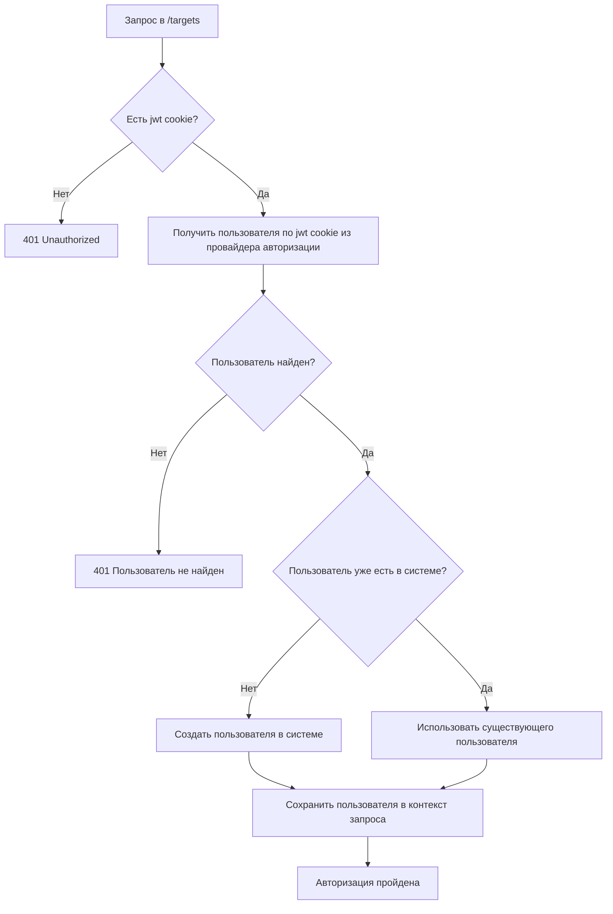
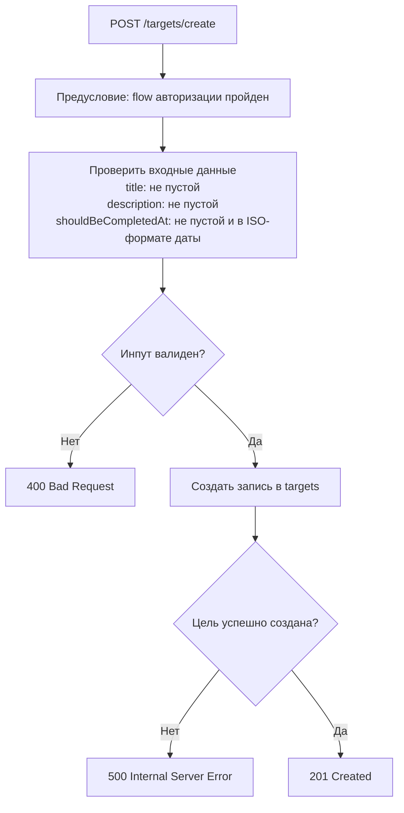
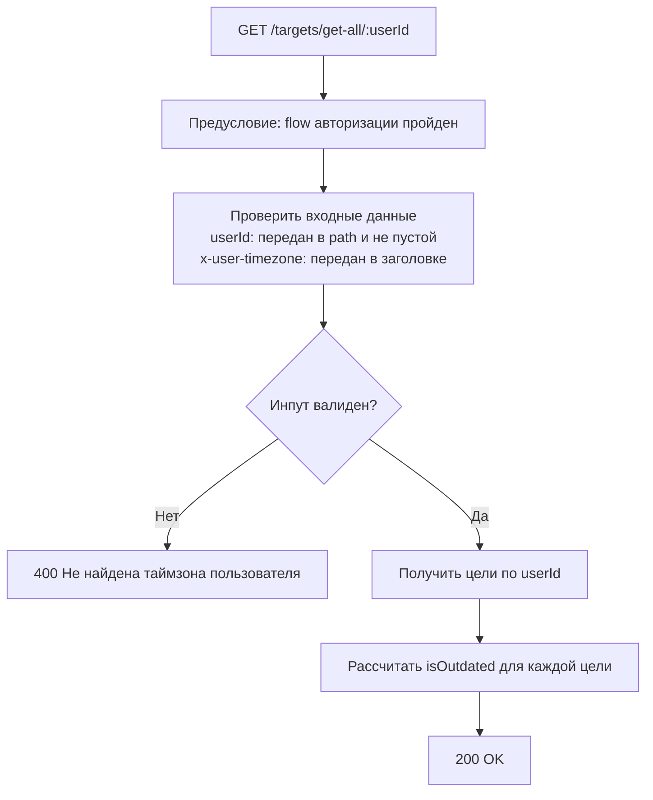

# 4. Бизнес-правила

## 4.1 Авторизация

1. Пользователь отправляет запрос в защищенный эндпоинт.
2. Система проверяет наличие `jwt` cookie.
3. Если cookie нет, система возвращает `401 Unauthorized`.
4. Если cookie есть, система получает пользователя из провайдера авторизации.
5. Если пользователь не найден, система возвращает `401`.
6. Если пользователь найден, система использует существующего пользователя в системе или создает нового.

Flow авторизации

## 4.2 Создание цели

1. Пользователь отправляет запрос на создание цели.
2. Система проверяет входные данные:
   `title` не пустой, `description` не пустой, `shouldBeCompletedAt` не пустой и в ISO-формате даты.
3. Система проверяет, что дата завершения цели больше текущей даты пользователя (по `x-user-timezone`).
4. Если проверки не пройдены, система возвращает `400`.
5. Если проверки пройдены, система создает цель в статусе `created`.

Flow создания цели (`POST /targets/create`)

## 4.3 Просмотр целей пользователя

1. Пользователь отправляет запрос на получение целей по `userId`.
2. Система проверяет, что передан заголовок `x-user-timezone`.
3. Если таймзона не передана, система возвращает `400`.
4. Если таймзона передана, система возвращает список целей пользователя.
5. Для каждой цели система рассчитывает `isOutdated`:
   если цель завершена, сравнивается `should_be_completed_at` и `completed_at`; иначе сравнение идет с текущей датой пользователя.

Flow получения целей (`GET /targets/get-all/:userId`)

## 4.4 Создание шага

1. Пользователь отправляет запрос на создание шага у цели.
2. Система проверяет входные данные:
   `title` не пустой, `description` не пустой, `shouldBeCompletedAt` не пустой и в ISO-формате даты.
3. Система проверяет, что дата завершения шага больше текущей даты пользователя (по `x-user-timezone`).
4. Система проверяет, что у этой цели нет другого шага с той же датой `shouldBeCompletedAt`.
5. Если проверки не пройдены, система возвращает `400`.
6. Если проверки пройдены, система создает шаг.

## 4.5 Просмотр шагов цели

1. Пользователь отправляет запрос на получение шагов цели по `targetId`.
2. Система проверяет, что передан заголовок `x-user-timezone`.
3. Если таймзона не передана, система возвращает `400`.
4. Если таймзона передана, система возвращает шаги цели.
5. Система возвращает шаги только для целей в статусах `created` и `active`.
6. Для каждого шага система рассчитывает `isOutdated`:
   если шаг завершен, сравнивается `should_be_completed_at` и `completed_at`; иначе сравнение идет с текущей датой пользователя.

## 4.6 Завершение шага

1. Пользователь отправляет запрос на завершение шага с обязательным комментарием по итогам шага.
2. Система проверяет, что шаг существует и принадлежит цели текущего пользователя.
3. Система проверяет, что цель шага находится в статусе `active`.
4. Система проверяет, что шаг еще не завершен (`completed_at` не заполнен).
5. Система проверяет, что текущая дата пользователя строго меньше дедлайна шага.
6. Система проверяет, что завершаемый шаг является следующим к выполнению:
   у него самый ранний дедлайн среди незавершенных шагов цели.
7. Если проверки не пройдены, система возвращает ошибку валидации/конфликта.
8. Если проверки пройдены, система проставляет `completed_at`.
9. Система отправляет уведомления в Telegram-бот:
   о приближении дедлайна шага и о просрочке шага.

## 4.7 Создание награды

1. Пользователь отправляет запрос на создание награды.
2. Система проверяет входные данные:
   `title` не пустой, `description` не пустой;
   `userId` (если передан) должен быть строкой, `targetId` (если передан) должен быть числом.
3. Тип награды определяется автоматически:
   если передан `userId`, тип `user`, иначе тип `target`.
4. Если проверки не пройдены, система возвращает `400`.
5. Если проверки пройдены, система создает награду.
