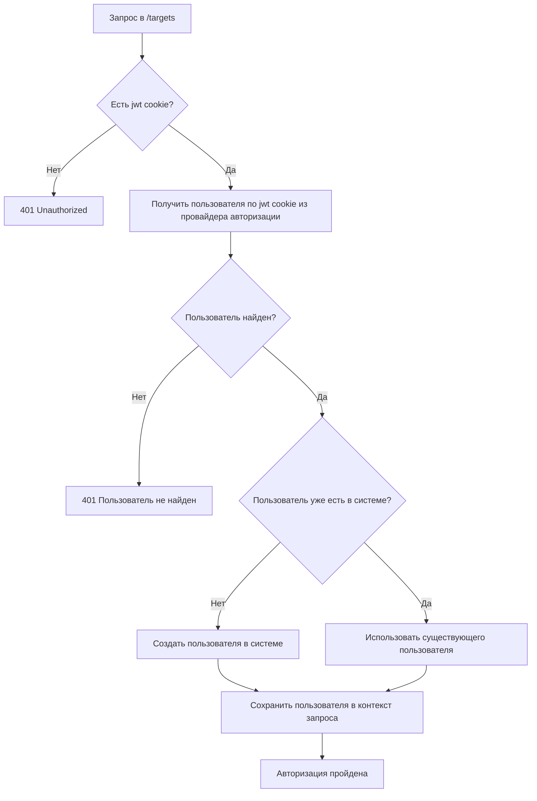
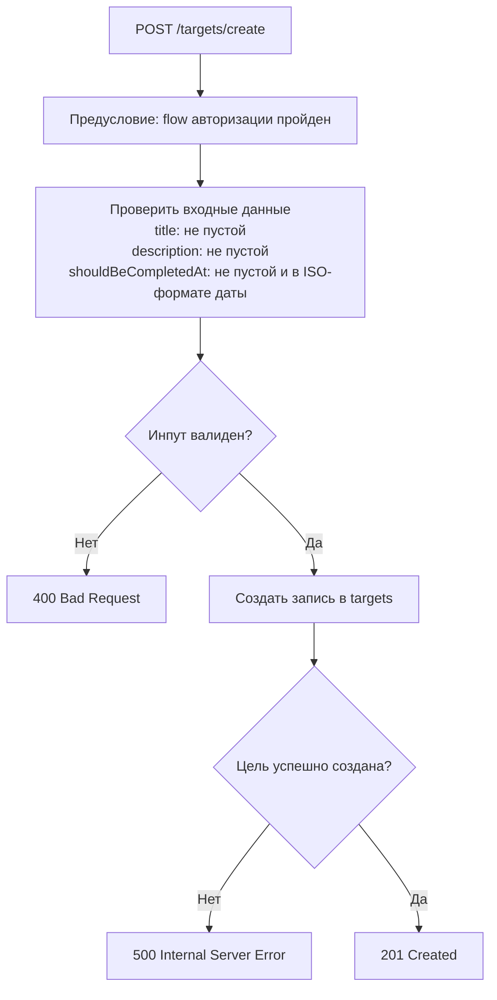
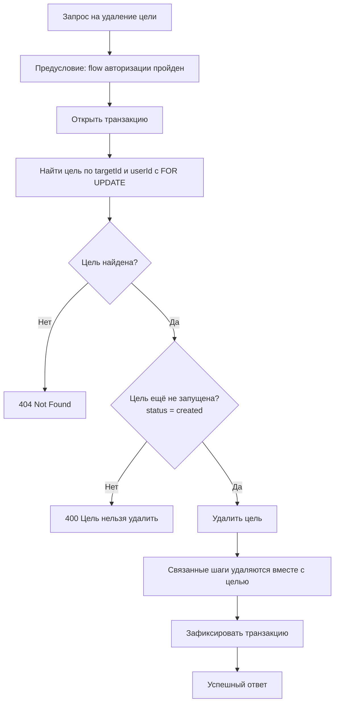
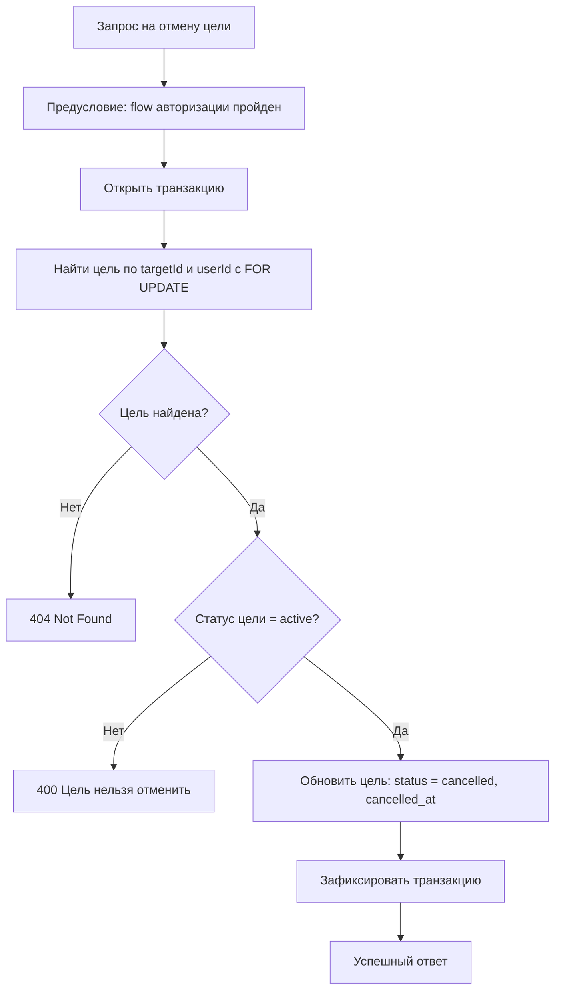
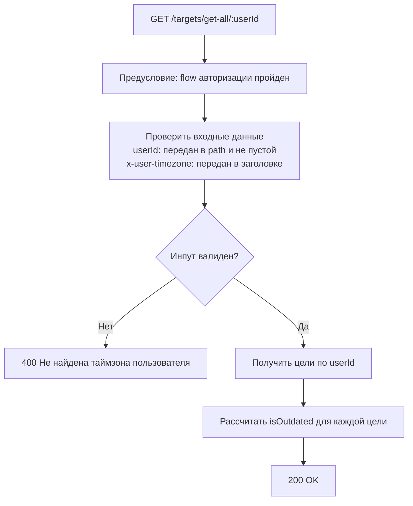
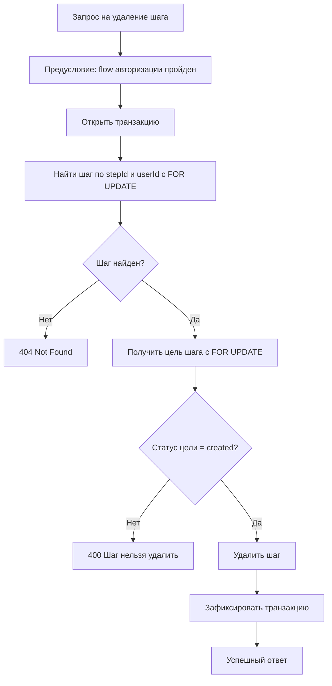
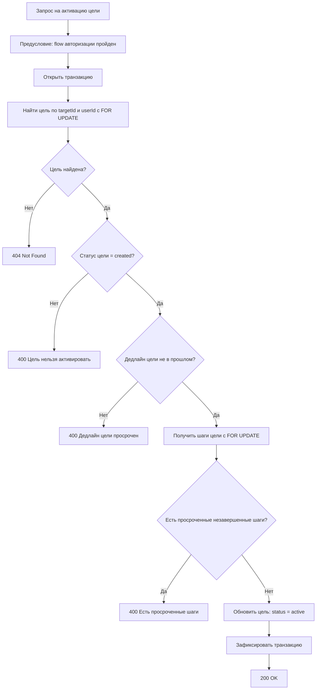
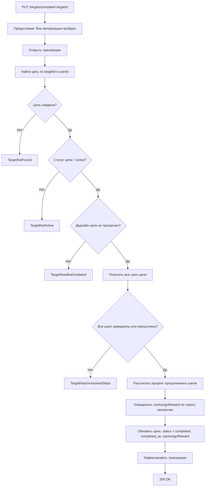
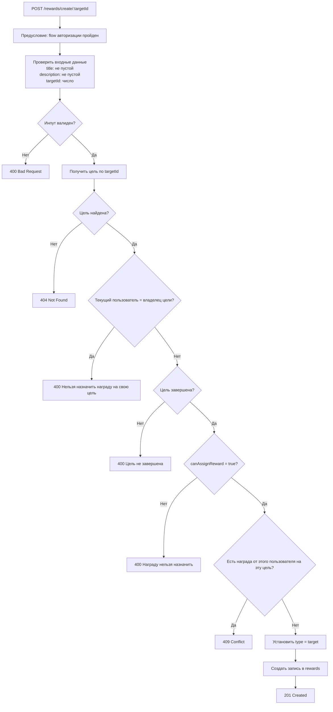

# 4. Бизнес-правила

## 4.1 Авторизация

1. Пользователь отправляет запрос в защищенный эндпоинт.
2. Система проверяет наличие `jwt` cookie.
3. Если cookie нет, система возвращает `401 Unauthorized`.
4. Если cookie есть, система получает пользователя из провайдера авторизации.
5. Если пользователь не найден, система возвращает `401`.
6. Если пользователь найден, система использует существующего пользователя в системе или создает нового.

Flow авторизации

## 4.2 Создание цели

1. Пользователь отправляет запрос на создание цели.
2. Система проверяет входные данные:
   `title` не пустой, `description` не пустой, `shouldBeCompletedAt` не пустой и в ISO-формате даты.
3. Система проверяет, что дата завершения цели больше текущей даты пользователя (по `x-user-timezone`).
4. Если проверки не пройдены, система возвращает `400`.
5. Если проверки пройдены, система создает цель в статусе `created`.

Flow создания цели (`POST /targets/create`)

## 4.3 Удаление цели

1. Пользователь отправляет запрос на удаление цели.
2. Система открывает транзакцию.
3. Система ищет цель по `targetId` и `userId` текущего пользователя с блокировкой строки.
4. Если цель не найдена, система возвращает `404`.
5. Система проверяет, что цель ещё не была запущена и находится в статусе `created`.
6. Если цель уже находится в статусе `active`, `completed` или `cancelled`, система возвращает `400`.
7. Если проверки пройдены, система удаляет цель.
8. Если у цели есть шаги, они удаляются вместе с целью.
9. Система фиксирует транзакцию.
10. Система возвращает успешный ответ.

Flow удаления цели (`DELETE /targets/delete/:targetId`)

## 4.4 Отмена цели

1. Пользователь отправляет запрос на отмену цели.
2. Система открывает транзакцию.
3. Система ищет цель по `targetId` и `userId` текущего пользователя с блокировкой строки.
4. Если цель не найдена, система возвращает `404`.
5. Система проверяет, что цель находится в статусе `active`.
6. Если цель уже находится в статусе `created`, `completed` или `cancelled`, система возвращает `400`.
7. Если проверки пройдены, система переводит цель в статус `cancelled`.
8. Система сохраняет дату и время отмены цели в `cancelled_at`.
9. Система фиксирует транзакцию.
10. Система возвращает успешный ответ.

Flow отмены цели (`POST /targets/cancel/:targetId`)

## 4.5 Просмотр целей пользователя

1. Пользователь отправляет запрос на получение целей по `userId`.
2. Система проверяет, что передан заголовок `x-user-timezone`.
3. Если таймзона не передана, система возвращает `400`.
4. Если таймзона передана, система возвращает список целей пользователя.
5. Для каждой цели система рассчитывает `isOutdated`:
   если цель завершена, сравнивается `should_be_completed_at` и `completed_at`; иначе сравнение идет с текущей датой пользователя.

Flow получения целей (`GET /targets/get-all/:userId`)

## 4.6 Создание шага

1. Пользователь отправляет запрос на создание шага у цели.
2. Система проверяет входные данные:
   `title` не пустой, `description` не пустой, `shouldBeCompletedAt` не пустой и в ISO-формате даты.
3. Система проверяет, что дата завершения шага больше текущей даты пользователя (по `x-user-timezone`).
4. Система проверяет, что у этой цели нет другого шага с той же датой `shouldBeCompletedAt`.
5. Система проверяет, что цель находится в статусе `created`.
6. Если цель уже находится в статусе `active`, создание шага запрещено.
7. Если проверки не пройдены, система возвращает `400`.
8. Если проверки пройдены, система создает шаг.

## 4.7 Удаление шага

1. Пользователь отправляет запрос на удаление шага.
2. Система открывает транзакцию.
3. Система ищет шаг по `stepId` и текущему пользователю с блокировкой строк.
4. Если шаг не найден, система возвращает `404`.
5. Система получает цель, к которой относится шаг, и проверяет, что она принадлежит текущему пользователю.
6. Система проверяет, что цель находится в статусе `created`.
7. Если цель уже находится в статусе `active`, `completed` или `cancelled`, система возвращает `400`.
8. Если проверки пройдены, система удаляет шаг.
9. Система фиксирует транзакцию.
10. Система возвращает успешный ответ.

Flow удаления шага (`DELETE /steps/delete/:stepId`)

## 4.8 Активация цели

1. Пользователь отправляет запрос на активацию цели.
2. Система открывает транзакцию.
3. Система ищет цель по `targetId` и `userId` текущего пользователя с блокировкой строки.
4. Если цель не найдена, система возвращает `404`.
5. Система проверяет, что цель находится в статусе `created`.
6. Если цель уже находится в статусе `active`, `completed` или `cancelled`, активация запрещена.
7. Система проверяет, что дедлайн цели не находится в прошлом относительно текущей даты пользователя по `x-user-timezone`.
8. Если дедлайн цели уже в прошлом, система возвращает `400`.
9. Система получает все шаги цели с блокировкой строк.
10. Система проверяет, что нет шагов с дедлайном в прошлом относительно текущей даты пользователя.
11. Если найден хотя бы один просроченный шаг, система возвращает `400`.
12. Если проверки пройдены, система переводит цель из статуса `created` в статус `active`.
13. Система фиксирует транзакцию.
14. Система возвращает активированную цель.

Flow активации цели (`PUT /targets/activate/:targetId`)

## 4.9 Просмотр шагов цели

1. Пользователь отправляет запрос на получение шагов цели по `targetId`.
2. Система проверяет, что передан заголовок `x-user-timezone`.
3. Если таймзона не передана, система возвращает `400`.
4. Если таймзона передана, система возвращает шаги цели.
5. Система возвращает шаги только для целей в статусах `created` и `active`.
6. Для каждого шага система рассчитывает `isOutdated`:
   если шаг завершен, сравнивается `should_be_completed_at` и `completed_at`; иначе сравнение идет с текущей датой пользователя.

## 4.10 Завершение шага

1. Пользователь отправляет запрос на завершение шага с обязательным комментарием по итогам шага.
2. Система проверяет, что шаг существует и принадлежит цели текущего пользователя.
3. Система проверяет, что цель шага находится в статусе `active`.
4. Система проверяет, что шаг еще не завершен (`completed_at` не заполнен).
5. Система проверяет, что текущая дата пользователя строго меньше дедлайна шага.
6. Система проверяет, что завершаемый шаг является следующим к выполнению:
   у него самый ранний дедлайн среди незавершенных шагов цели.
7. Если проверки не пройдены, система возвращает ошибку валидации/конфликта.
8. Если проверки пройдены, система проставляет `completed_at`.
9. Система отправляет уведомления в Telegram-бот:
   о приближении дедлайна шага и о просрочке шага.

## 4.11 Завершение цели

1. Пользователь отправляет запрос на завершение цели.
2. Система открывает транзакцию.
3. Система ищет цель по `targetId` и `userId` текущего пользователя.
4. Если цель не найдена, система возвращает ошибку `TargetNotFound`.
5. Система проверяет, что цель находится в статусе `active`.
6. Если цель не активна, система возвращает ошибку `TargetNotActive`.
7. Система проверяет, что дедлайн цели еще не наступил.
8. Если дедлайн цели просрочен, система возвращает ошибку `TargetDeadlineOutdated`.
9. Система получает все шаги цели.
10. Если найден хотя бы один шаг, который не завершен и его дедлайн еще не наступил, система возвращает ошибку `TargetHasUnresolvedSteps`.
11. Система рассчитывает процент просроченных шагов и определяет значение `canAssignReward`:
    `true`, если процент просроченных шагов меньше установленного порога;
    `false`, если процент просроченных шагов больше либо равен установленному порогу.
12. Система переводит цель в статус `completed`.
13. Система сохраняет дату и время завершения цели в `completed_at`.
14. Система сохраняет значение `canAssignReward`.
15. Система фиксирует транзакцию.
16. Система возвращает данные завершенной цели.

Flow завершения цели (`PUT /targets/complete/:targetId`)

## 4.12 Создание награды на цели

1. Пользователь отправляет запрос на создание награды на цели.
2. Система проверяет входные данные:
   `title` не пустой, `description` не пустой, `targetId` должен быть числом.
   1. Если проверки не пройдены, система возвращает `400`.
3. Система получает цель по `targetId`.
   1. Если цель не найдена, система возвращает `404`.
4. Система проверяет, что текущий пользователь не является владельцем цели.
   1. Если пользователь пытается назначить награду на собственную цель, система возвращает `400`.
5. Система проверяет, что цель находится в статусе `completed`.
   1. Если цель не завершена, система возвращает `400`.
6. Система проверяет, что у цели `canAssignReward = true`.
   1. Если у цели `canAssignReward = false`, система возвращает `400`.
7. Система проверяет, что у текущей цели ещё нет награды от пользователя, который назначает награду.
   1. Если награда на эту цель от этого пользователя уже существует, система возвращает `409 Conflict`.
8. Если все проверки пройдены, система явно устанавливает `type = target`.
9. Система создает награду.
10. Система возвращает `201 Created`.

Flow создания награды на цели (`POST /rewards/create/:targetId`)

