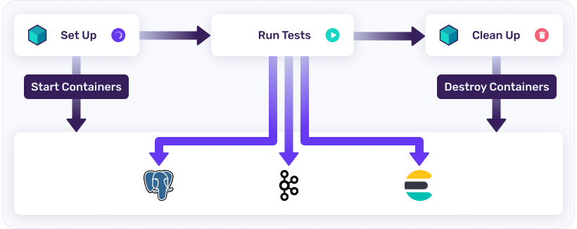

# 1. Интеграционное тестирование БД с помощью testcontainers

Сейчас есть проблема: невозможно протестировать SQL-запросы, которые пишутся
в проекте из-за отсутствия подключения к тестовой БД.

Поэтому нужно использовать testcontainers для
создания контейнера с тестовой БД при прогоне тестов.

Какой профит от использование testcontainers:

- полноценный e2e (почти)
- изоляция сервисов: сервисы создаются через testcontainers и используются напрямую в тестах

## Алгоритм перехода на testcontainers

1. Убрать SQL из сервисов путем создания Repository в DAL (data access layer)
2. Оставить в сервисах бизнес-логику
3. Установить Testcontainers
4. Создать test setup контейнера БД c заменой process.env.DATABASE_URL
5. Настроить прогон миграций после старта контейнера в тестах
6. Подготовить seed/factories для тестовых данных
7. Написать e2e-тесты для Repository
